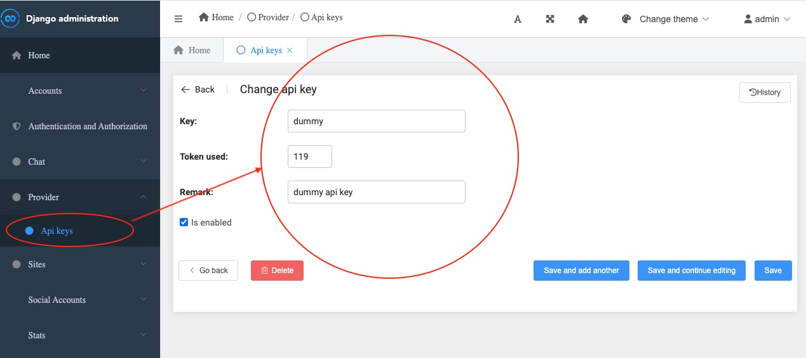

<h1>ChatGPT UI</h1>

A fork from the original repo [https://github.com/WongSaang/chatgpt-ui-server](https://github.com/WongSaang/chatgpt-ui-server).
The main change is replacing OpenAI with Azure OpenAI

## How to start

1. Check out the code
2. Copy .env.example to .env and add necessary Azure OpenAI settings
3. Use `docker compose up -d` to start the servers
4. BEFORE attempting to login, open 'localhost:9000/admin' in a browser. Add a dummy key as shown below

5. Open `localhost` in a browser to start

